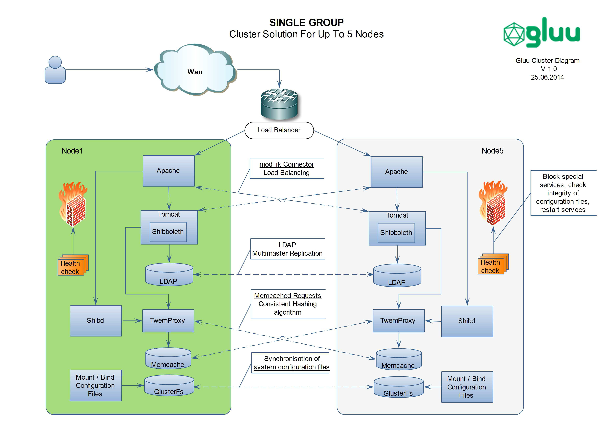
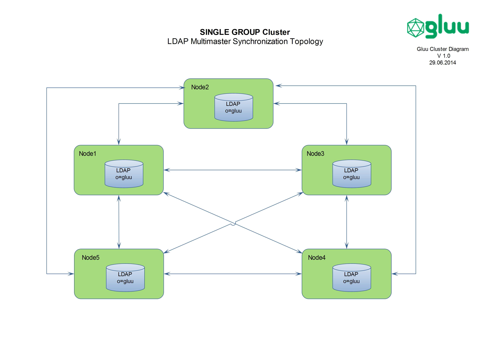
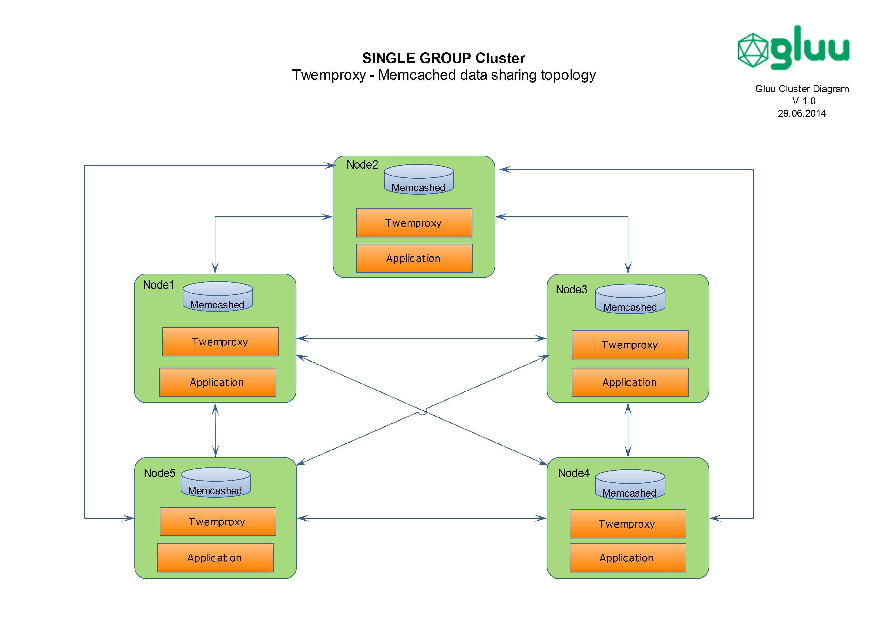

# GLUU cluster

## Objectives

The purpose of the technical design is to confirm that the Supplier has identified all the
technical and technological requirements of the Purchaser and has defined the solutions
that meet these requirements.

## Glossary

* IDP - Identity Provider
* HA - High Availability
* IDS – Intrusion Detection System
* IPS – Intrusion Prevention System

## Introduction

The purpose of the Document is to describe cluster solution for GLUU Inc. Cluster solution
should be cost effective, flexible, should provide geographic redundancy and scalability,
solution should not impact on main requirements of security in order to it will be
implemented in datacenters where security requirements are high.

## Network And Sceurity Design

The network HA can be various, it depends on the place of installation and special design. Protecting the internal
network from threats can be implemented by firewalls subsystems and IPS / IDS. The
connections between data centers can be implemented via the Internet through the
encrypted or protected connections.
Some data centers have special security requirements. In case of all in one installation (all
components running on single node) it can impact the security requirement “one primary
function per server” to cover this type of requirement and do not lose cost effectiveness,
the application components will be installed in one node but under different chroot
environments. It can be divided in following environments (Apache, Shibboleth, Tomcat,
Ldap).

## Cluster Description

Logical network diagram of **Cluster** is presented in [Figure 1](../../img/cluster/cluster.png)

* Inside cluster the quantity of active nodes with all in one installation can
be no more than 5 nodes. If there will be necessity to increase quantity of nodes,
then must be used **Geo Cluster** approach.

* **Cluster** is better to use inside of one data center or it can be used in different datacenters where quality and HA of network inter connection is
high.

* For easy and fast installation of IDP environment in every node, inside of cluster
can be used single Linux distribution package.

*Figure 1*

### Technologes

The following Technologies are used in cluster solutions.

#### Loda Balancer

* Distributing workloads across multiple Nodes direct to apache servers in top
of cluster can be used any hardware load balancer.

#### Mod_jk

* For distributing workloads from apache server between Tomcat servers must
be used mod_jk connector with load balancing mechanism.

#### OpenDJ

* For OpenDJ - LDAP replication must be used multimaster synchronization
mechanism. The replication topology and suggestions have been taken from
official site of Opendj. LDAP Replication Topology for **Cluster** is
presented in [Figure 2](../../img/cluster/ldap.png).

*Figure 2*

#### Memcached

* In order to decrease database loads and network requests, following
technologies must be used to connect memcached.

#### Twemproxy

* To share the keys stored in memcached between clustered nodes and to
avoid using sticky session sharing mechanism, **TwemProxy** proxy server
must be used. The information sharing between memcached inside of nodes
will be distributed using consistent hashing algorithm. (TwemProxy is a
fast, light-weight proxy for the memcached protocol. Twemproxy was
primarily developed to reduce open connections to Twitter cache servers.).
TwemProxy logical connection topology for **Cluster** is presented in [Figure 3](../../img/cluster/twemproxy.png).

*Figure 3*

TwemProxy detailed connection topology between two nodes for **Cluster** is presented [Figure 4](../../img/cluster/twemproxy2.png)

*Figure 4*

#### GlusterFS

* To share configuration or static files between nodes must be used GlusterFS
technology. GlusterFS logical connection topology for **Cluster** is
presented in [Figure 5](../../img/cluster/glusterfs.png).

*Figure 5*

* GlusterFS detailed connection topology between two nodes for **Cluster** 
is presented in [Figure 6](../../img/cluster/glusterfs.png). 
The files and directories inside of GlusterFS mount point can be mounted to 
the appropriate place in local node with bind option in mount utility.

*Figure 6*

### Health Check Script

Heath check script must check health status of

* System components. According checking algorithm appropriate
service can be stopped or isolated from cluster, using firewall
rules inside of Nodes. (Checking algorithm must be provided in
other document)

* Integrity checking of files inside of mount point of GlusterFS.
Collecting centralized integrity checking information can help to
monitor and determine the failure of GlusterFS inside of node.

* The status of component which is responsible for restarting a
service in current node. (Can be implemented in LDAP or in status
file inside of GlusterFS)

#### Process Flow Chart Chart Inside Of Single Node

Figure 7

## Geo Cluster
- [Geo Cluster](./geo_cluster.md)