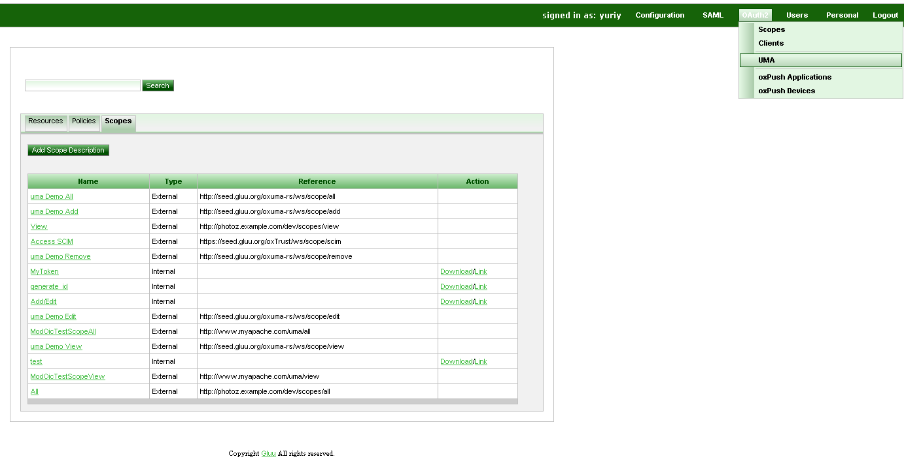

# UMA Scopes

UMA Scopes is central part of UMA protocol which is bound to resource set and is used by policy to check whether user has access to resource or not.

In UMA Scope is described by json document and has following properties:

- name - name of scope (e.g. View photo, Edit photo)
- icon_uri - optional property to specify icon for photo

Example of typical json document of scope:

```
{
  "name": "Add photo",
  "icon_uri": "http://www.gluu.org/icons/add_photo_scope.png"
}
```

Scope description json document MAY contains custom properties which is out of scope of this document.

## Define UMA Scopes via oxTrust




## Implementation specificity

Scopes types:

- internal - hosted on oxAuth (must provide scope description);
- external - hosted on other servers;
- external_auto - scope hosted on other server but which is automatically added during resource set registration or update.

**Note:** there is no url for internal scope because it's configurable and depends on oxAuth hosting.

uma url = uma_scopes_endpoint + "/" + oxId;

http://gluu.org/uma/scopes/view = http://gluu.org/uma/scopes + "/" + view

Under http://gluu.org/uma/scopes/view server must provide scope description as json document:

**Note:** Scope endpoint must be present in uma configuration to make it discoverable.

#### External sample ldif

```
dn: inum=@!1111!8990!BF80,ou=scopes,ou=uma,o=@!1111,o=gluu
displayName: View
inum: @!1111!8990!BF80
objectClass: oxAuthUmaScopeDescription
objectClass: top
oxType: external
oxUrl: http://photoz.example.com/dev/scopes/view
```

#### Internal sample ldif

```
dn: inum=@!1111!8990!BF80,ou=scopes,ou=uma,o=@!1111,o=gluu
displayName: View
inum: @!1111!8990!BF80
objectClass: oxAuthUmaScopeDescription
objectClass: top
oxType: internal
oxId: View
oxIconUrl: http://seed.gluu.org/uma/icons/view_scope.png
```

## References
- [UMA Specifications](http://kantarainitiative.org/confluence/display/uma/UMA+1.0+Core+Protocol)
- [UMA Requestion Party Sample implementation](https://svn.gluu.info/repository/openxdi/oxUmaDemo/RP/)
- [UMA Resource Server Sample implementation](https://svn.gluu.info/repository/openxdi/oxUmaDemo/RS/)
- [Gluu Server](http://gluu.org)
- [Juju Application Security Framework (JASF) Overview](http://www.gluu.co/juju-draft-overview)
- [UMA](http://kantarainitiative.org/confluence/display/uma/UMA+1.0+Core+Protocol)
